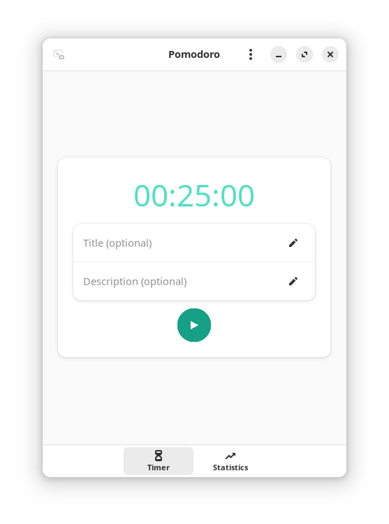

# Pomodoro

A simple timer application, its main objective is to be simple, and intuitive.



## Features
- History
- Statistics
- Run in background
- Feedback sounds
- Progress notification

## Flathub
<a href='https://flathub.org/apps/io.gitlab.idevecore.Pomodoro'></a>

## Building

###  Requirements
- Gjs `gjs` 
- GTK4 `gtk4` 
- libadwaita (>= 1.2.0) `libadwaita`
- Meson `meson` 
- Ninja `ninja` 
- D-Bus `python-dbus`

### Building from Git
```bash 
 git clone --recurse-submodules https://gitlab.com/idevecore/pomodoro.git
 cd pomodoro
 meson builddir --prefix=/usr/local 
 sudo ninja -C builddir install 
 ```

## Translations

[](https://hosted.weblate.org/engage/pomodoro/) ✨Powered by [Weblate](https://weblate.org/en/)✨

Pomodoro has been translated into the following languages:

<a href="https://hosted.weblate.org/engage/pomodoro/">

</a>

Please help translate Pomodoro into more languages through [Weblate](https://hosted.weblate.org/engage/pomodoro/).

## Important Notice
I would like to inform you that the development of Pomodoro is currently on hold with no expected date for resumption. Due to this pause, the app will be removed from all app stores.

Please note that from now on, the only way to obtain the app will be through its source code, which is publicly available.

Legal Disclaimer: I am not responsible for any use of the app in its current state. By choosing to use it, you do so at your own risk.

Thank you for your understanding and support.

## License 
 [GNU General Public License 3 or later](https://www.gnu.org/licenses/gpl-3.0.en.html)
